## Automated Deployment of Modern Two-Tier Infrastructure on Azure with CI/CD

### Overview:

This project entails the creation of a scalable two-tier infrastructure on Microsoft Azure using Terraform. The architecture features a Linux Web App and Cosmos DB for MongoDB, with GitHub Actions orchestrating the Continuous Integration/Continuous Deployment (CI/CD) pipeline. Azure Application Insights is integrated for monitoring and logging, providing comprehensive observability.

### Project Components:

#### Azure Resources Provisioned with Terraform:

- **Linux Web App:** A reliable Linux-based Web App is provisioned for consistency and reproducibility.
- **Cosmos DB for MongoDB:** Automated provisioning of Cosmos DB for seamless integration with the Web App.

#### CI/CD Pipeline with GitHub Actions:

- **Docker Containerization:** Application containerization using Docker for deployment consistency.
- **GitHub Actions Workflow:** Orchestration of the CI/CD pipeline triggers Docker image building and pushing to DockerHub.

#### Integration of Docker Image with Terraform:

- The Docker image build output is dynamically updated in the Azure Terraform configuration for the Linux Web App, ensuring automatic deployment of the latest version.

#### Monitoring and Logging with Azure Application Insights:

- **Proactive Monitoring:** Azure Application Insights enables proactive monitoring of Web App performance, availability, and usage.
- **Logging Integration:** Seamless integration capturing application logs and telemetry data for real-time insights and troubleshooting.

### Steps:

1. **Set up Azure OpenID Connect (OIDC) within GitHub Actions for Terraform:**
   - implemented authentication using OpenID Connect (OIDC) within GitHub Actions and Utilized OIDC tokens to authenticate and authorize Terraform operations.
   - Configure necessary environment variables for authentication.
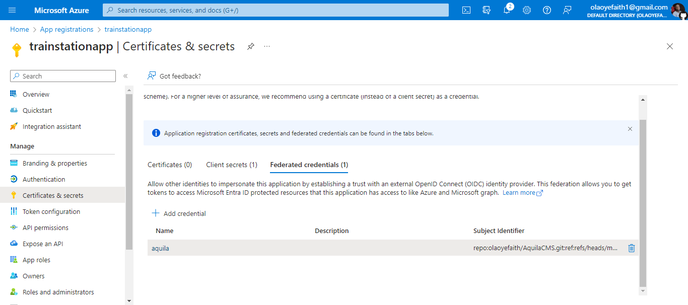

2. **Define Terraform Configuration:**
   - Create Terraform scripts defining infrastructure components.
   - Utilize Terraform modules for reusability and maintainability.
```

resource "azurerm_linux_web_app" "fe-webapp" {
  name                  = "Aquila-frontend"
  location              = azurerm_resource_group.rg.location
  resource_group_name   = azurerm_resource_group.rg.name
  service_plan_id       = azurerm_service_plan.fe-asp.id
  https_only            = true
  
 site_config { 
    container_registry_use_managed_identity = true
     minimum_tls_version =  "1.2"
    always_on = true
   application_stack{
     
      docker_image = __DOCKER_IMAGE__ 
      docker_image_tag = __DOCKER_IMAGE_TAG__
     }
  }
  }

```
  
3. **Set up Dockerfile and GitHub Actions Workflow:**
   - Write a Dockerfile to containerize the application.
   - Create a GitHub Actions workflow YAML file to define the CI/CD pipeline.
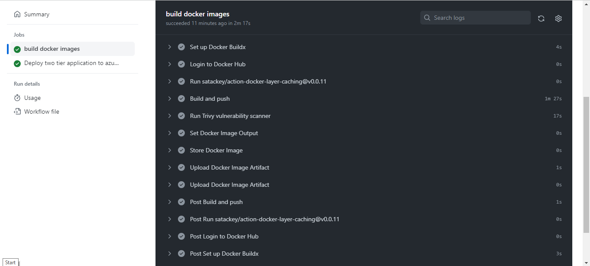

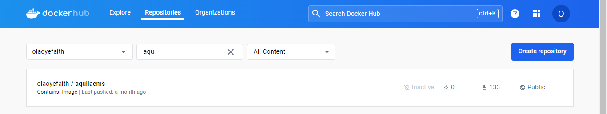

4. **Integrate Docker Image with Terraform:**
   - Modify Terraform scripts for the Linux Web App to accept Docker image tags.
   - Dynamically update Docker image tags in Terraform configuration using GitHub Actions.


5. **Provision Azure Resources with Terraform:**
   - Run `terraform init` and `terraform apply` to provision infrastructure on Azure.
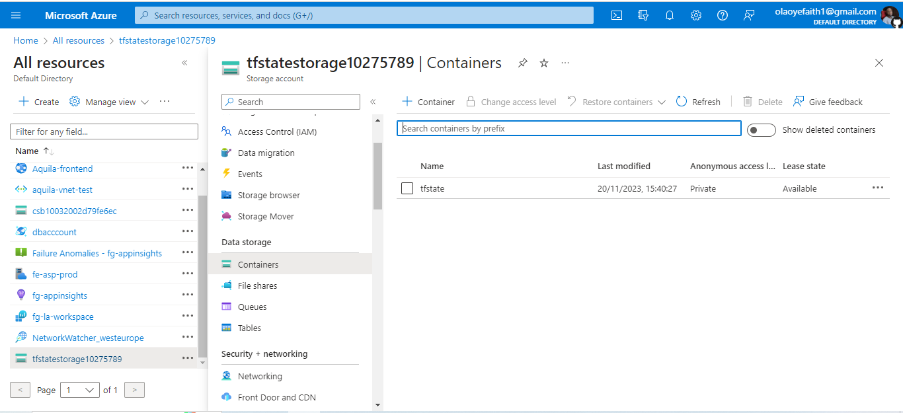

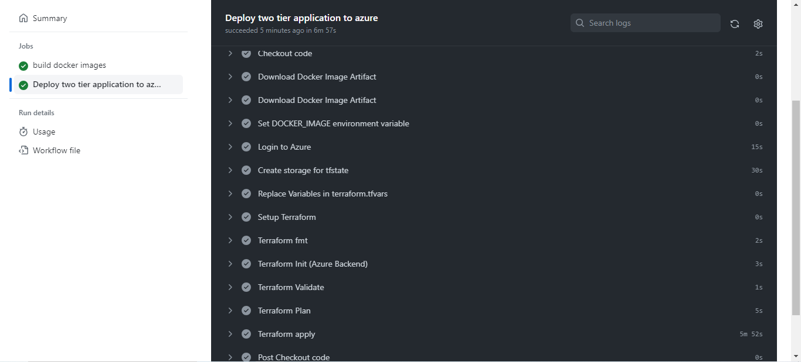

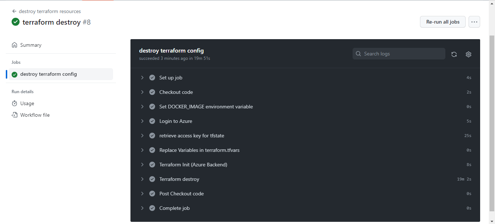

6. **Implement Monitoring and Logging with Azure Application Insights:**
   - Integrate Azure Application Insights into Terraform scripts for Web App and Cosmos DB.
   - Configure telemetry settings and logging options.

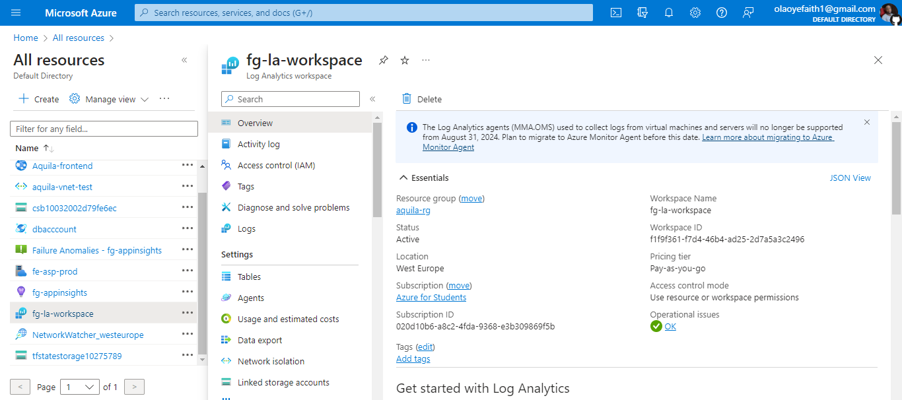

7. **Execute CI/CD Pipeline:**
   - Trigger GitHub Actions workflow with code changes.
   - Observe workflow executing build, Docker image push, and Terraform configuration update.

 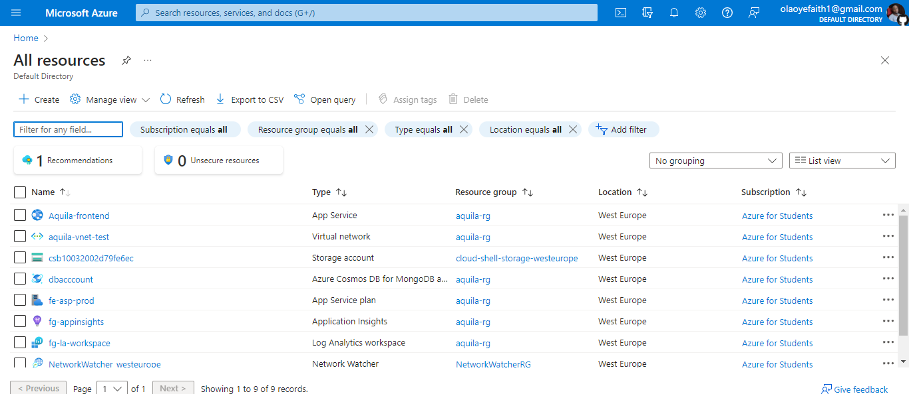

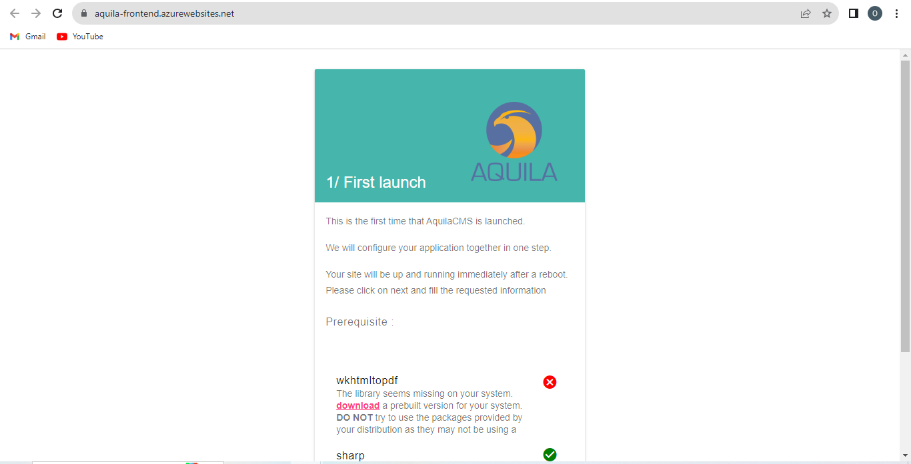

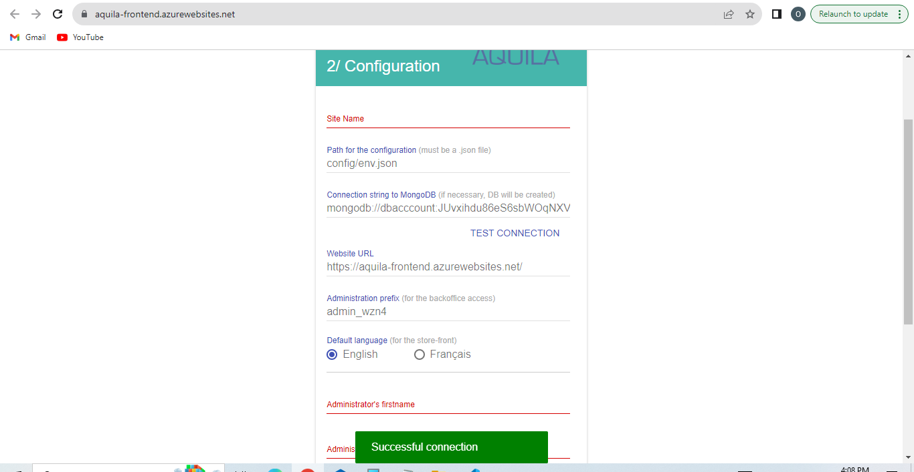

8. **Monitor and Troubleshoot:**
   - Utilize Azure Portal to monitor deployed resources in Application Insights.
   - Review logs and telemetry data for troubleshooting and performance optimization.

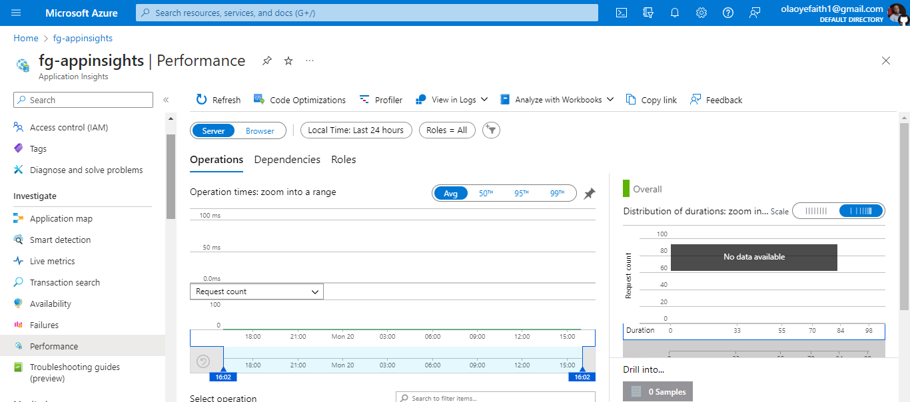


